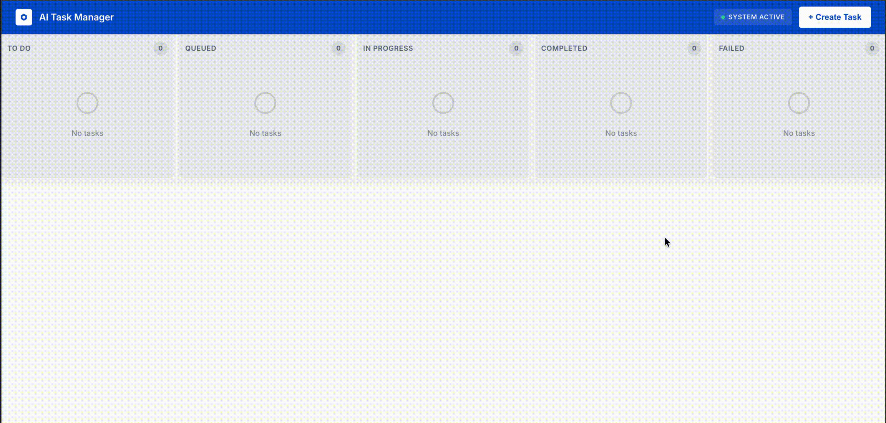

# AI Task Manager

An AI-powered task management system with a Jira-like interface where tasks are automatically executed by intelligent agents based on their tags (coding, documentation, etc.).

## Demo



## Features

- **Jira-like Kanban Board**: Drag-and-drop interface with multiple status columns
- **Intelligent Agents**: Auto-execute tasks based on tags (coding, documentation)
- **Real-time Updates**: Live status changes and execution logs via WebSocket
- **Auto-execution**: Tasks execute immediately upon creation
- **GitHub Integration**: Coding agent creates PRs for code changes
- **Confluence Integration**: Documentation agent publishes to Confluence

## Tech Stack

### Frontend
- React 18+ with TypeScript
- Vite (build tool)
- @dnd-kit (drag & drop)
- @tanstack/react-query (server state)
- Tailwind CSS (styling)
- WebSocket client

### Backend
- Go 1.21+
- Gin (HTTP framework)
- GORM (ORM)
- Gorilla WebSocket
- go-git (Git operations)
- go-github (GitHub API)
- Anthropic SDK (Claude API)

### Database
- MySQL 8.0

## Monorepo Structure

```
ai-task-manager/
├── apps/
│   ├── backend/          # Go backend application
│   └── frontend/         # React frontend application
├── packages/             # Shared packages (future use)
├── turbo.json           # Turborepo configuration
└── package.json         # Root package.json
```

## Prerequisites

- Node.js 18+
- Go 1.21+
- MySQL 8.0
- npm or yarn

### API Keys (you provide)
- Anthropic API key
- GitHub personal access token (scope: repo)
- (Optional) Confluence API token

## Installation

1. **Clone the repository**
```bash
git clone <repo-url>
cd ai-task-manager
```

2. **Install root dependencies**
```bash
npm install
```

3. **Setup Backend**
```bash
cd apps/backend
cp .env.example .env
# Edit .env with your API keys and database credentials
go mod download
```

4. **Setup Frontend**
```bash
cd apps/frontend
npm install
cp .env.example .env.local
# Edit .env.local with API URLs
```

5. **Create MySQL Database**
```bash
mysql -u root -p
CREATE DATABASE ai_task_manager;
exit
```

## Development

**Run both apps in parallel:**
```bash
npm run dev
```

**Run backend only:**
```bash
npm run backend:dev
```

**Run frontend only:**
```bash
npm run frontend:dev
```

**Build all apps:**
```bash
npm run build
```

## Access

- Frontend: http://localhost:5173
- Backend API: http://localhost:8080
- WebSocket: ws://localhost:8080/ws

## Usage

### Creating a Coding Task

Create a task with tag `coding` and provide metadata:
```json
{
  "repo_url": "https://github.com/username/repo",
  "branch": "main",
  "files_to_modify": ["src/components/Button.tsx"],
  "instruction": "Add loading state to Button component"
}
```

The coding agent will:
1. Clone the repository
2. Create a feature branch
3. Use Claude AI to generate code changes
4. Commit and push changes
5. Create a GitHub Pull Request

### Creating a Documentation Task

Create a task with tag `documentation` and provide metadata:
```json
{
  "confluence_space": "DEV",
  "page_title": "API Documentation",
  "content_source": "file",
  "source_value": "src/api/routes.go",
  "instruction": "Generate comprehensive API documentation"
}
```

The documentation agent will:
1. Connect to Confluence
2. Read source content
3. Use Claude AI to generate documentation
4. Create or update Confluence page
5. Return the page URL

## Architecture

The system uses a queue-based architecture with worker pools:
- Tasks are auto-queued upon creation
- 3 concurrent workers process tasks
- Status updates are broadcast via WebSocket
- Tasks progress: todo → queued → in_progress → completed/failed

## License

MIT

## Contributing

Pull requests are welcome! Please ensure tests pass before submitting.
